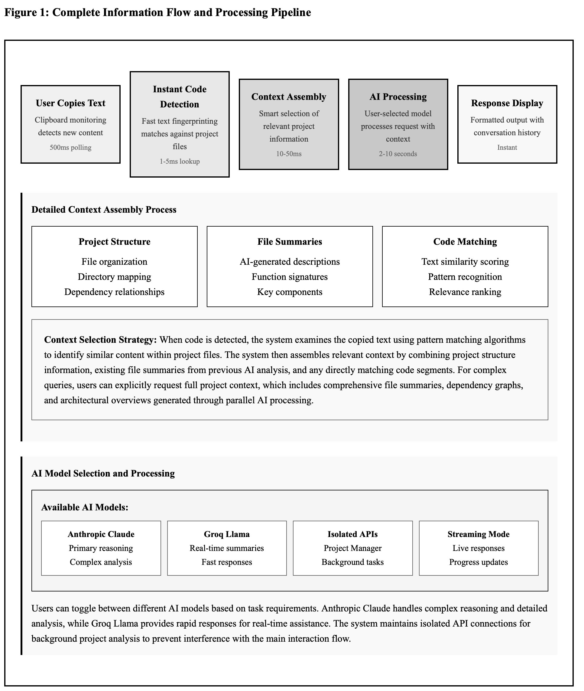
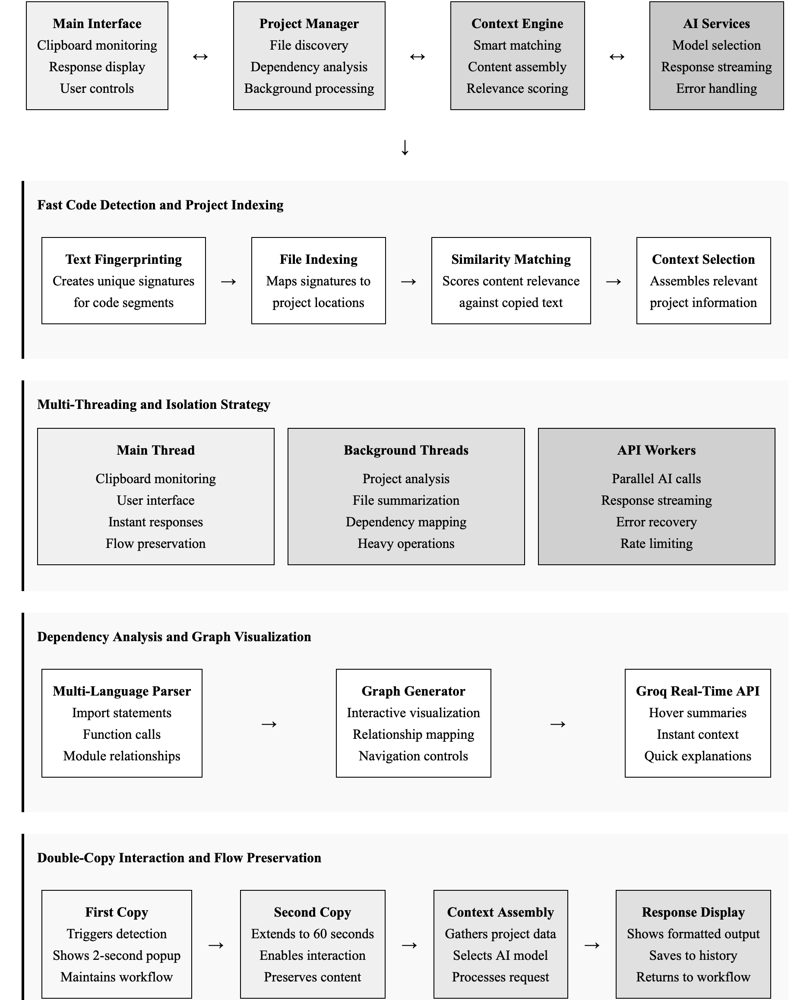

# Lumen - AI-Powered Personal Assistant

Lumen is an intelligent clipboard assistant that uses AI to help you process and understand copied content. It features automatic code detection, project context awareness, and seamless integration with multiple AI providers.

## Features

- 🚀 **Smart Clipboard Monitoring**: Automatically detects when you copy text and offers AI assistance
- 📁 **Project Context Awareness**: Links to your code projects for enhanced understanding
- 🔍 **Instant Code Detection**: Identifies copied code snippets and finds source files
- 🤖 **Multiple AI Providers**: Supports Anthropic Claude, OpenAI, Groq, and DeepSeek
- 🎨 **Rich UI**: PyQt5-based interface with syntax highlighting and dependency visualization
- 📊 **File Dependency Analysis**: Visualize project structure and dependencies

## Installation

### Prerequisites

- Python 3.8 or higher
- pip package manager
- Git (for cloning the repository)

### Setup

1. Clone the repository:
```bash
git clone <repository-url>
cd "Lumen"
```

2. Create a virtual environment (recommended):
```bash
python -m venv venv
source venv/bin/activate  # On Windows: venv\Scripts\activate
```

3. Install dependencies:
```bash
pip install -r requirements.txt
```

4. Configure API keys:
   - Copy `.env.example` to `.env`
   - Add your API keys to the `.env` file:
```env
ANTHROPIC_API_KEY=your_key_here
GROQ_API_KEY=your_key_here
# Add other API keys as needed
```

## Usage

### Starting Lumen

Run the main application:
```bash
python main.py
```

### Basic Workflow

1. **Copy any text** to your clipboard
2. **Press Cmd+C (Mac) or Ctrl+C (Windows/Linux)** again within 2 seconds
3. A popup will appear with options to:
   - Add context or modify the query
   - Include project context
   - Select detected source files
4. **Press Enter** to process with AI or **Escape** to cancel

### Project Management

1. Click **Project Manager** in the main window
2. Link a project directory to enable:
   - Automatic code file detection
   - AI-powered file summaries
   - Dependency visualization
3. Select files and click "Summarize" for AI descriptions

### Keyboard Shortcuts

- **Cmd/Ctrl+C (twice)**: Show AI assistant popup
- **Enter**: Process query
- **Escape**: Cancel/dismiss popup
- **Arrow Keys**: Navigate through response history

## Configuration

### Environment Variables

Create a `.env` file with the following variables:

- `ANTHROPIC_API_KEY`: Your Anthropic API key
- `GROQ_API_KEY`: Your Groq API key
- `OPENAI_API_KEY`: Your OpenAI API key (optional)
- `DEEPSEEK_API_KEY`: Your DeepSeek API key (optional)
- `LOG_LEVEL`: Logging level (DEBUG, INFO, WARNING, ERROR)
- `DEBUG`: Enable debug mode (true/false)

### Settings

Access settings through the main window to configure:
- Clipboard check intervals
- Popup timeout durations
- Clipboard preservation options

## Project Structure

```
Lumen/
├── main.py              # Application entry point
├── config.py            # Configuration management
├── logger_config.py     # Logging setup
├── TextWindow.py        # Main UI window
├── anthropic_api.py     # Anthropic API client
├── project_linker.py    # Project management
├── file_summarizer.py   # AI file summaries
├── requirements.txt     # Python dependencies
└── .env.example         # Environment template
```

### Project Architecture



## Troubleshooting

### Common Issues

1. **API Key Errors**: Ensure your `.env` file contains valid API keys
2. **Import Errors**: Install all dependencies with `pip install -r requirements.txt`
3. **UI Issues**: Ensure PyQt5 is properly installed for your system
4. **Clipboard Access**: On macOS, grant Terminal/IDE clipboard access permissions
5. **OPENAI API KEY**: Make sure your api/openai_api.py file contains your api key

### Logs

Check `logs/lumen.log` for detailed error messages and debugging information.

## Contributing

1. Fork the repository
2. Create a feature branch (`git checkout -b feature/amazing-feature`)
3. Commit your changes (`git commit -m 'Add amazing feature'`)
4. Push to the branch (`git push origin feature/amazing-feature`)
5. Open a Pull Request

## License

This project is licensed under the MIT License - see the LICENSE file for details.

## Acknowledgments

- Built with PyQt5 for the user interface
- Powered by Anthropic Claude and other AI providers
- Uses NetworkX for dependency graph analysis
